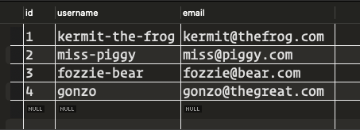
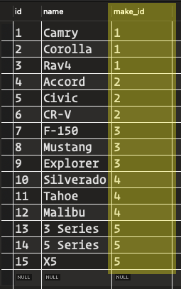
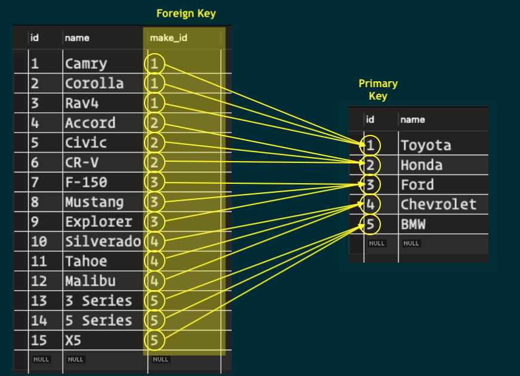
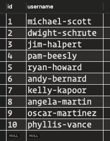
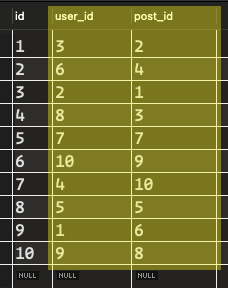

# Database Design

**Table of Contents:**
- [Database Design](#database-design)
  - [Intro](#intro)
  - [MySQL](#mysql)
    - [Tabular Format](#tabular-format)
  - [MySQL Data Types](#mysql-data-types)
  - [Entity Relationship Diagrams](#entity-relationship-diagrams)
  - [Relationships](#relationships)
    - [Foreign Keys](#foreign-keys)
    - [One-to-One Relationships](#one-to-one-relationships)
    - [One-to-Many Relationships](#one-to-many-relationships)
    - [Many-to-Many Relationships](#many-to-many-relationships)

## Intro
Today we are discussing Entity Relationship Diagrams (ERDs) and the fundamental principles of database design. In this session, we will explore the basics of Entity Relationship Diagrams (ERDs), MySQL data types, principles of database design, normalization, and the various types of relationships commonly found in database systems.

## MySQL
The database we will be using for both of our stacks is MySQL, a relational database system. A relational database organizes data into one or more data tables in which data may be related to each other; these relations help structure the data.

### Tabular Format
We can use the concept of spreadsheets to help us visualize these data tables. Spreadsheets have columns and rows, just like a MySQL table.

Let's see what a table of heroes might look like in a spreadsheet.

As we can see, our heroes can be represented by rows and columns in a spreadsheet.

Now let's see what they might look like in a MySQL table.

We have added some columns, but the rest of the data is identical to the previous screenshot. Let's take a closer look at the added columns:

1. `id`: This column is known in MySQL as the *primary key*. The primary key column is a like a license plate for a car. No other row has the same `id`, just like no other car has the same license plate.

   It's a special column in a table that holds a unique value for each row, making it easy for the database to find and manage that row of information.

   This helps keep all the information organized and makes it faster for the database to find what you're looking for. Try to think of other IRL examples of *unique identifiers*.

2. `created_at`: This column keeps track of what date and time this row was added to the database.
3. `updated_at`: This column keeps track of what date and time this row was last updated.

**Every table we create in MySQL will have at least these three columns.**

## MySQL Data Types
Just like our values have data types in JavaScript, we can also define data types for our columns in MySQL.

[This module in the Learn Platform](https://login.codingdojo.com/m/246/8446/57268) has the definitions of the data types we will use in this course.

What is the data type of each column in the heroes table?

  
Click to reveal the answers:

  
  `id`: INT
  `name`: VARCHAR
  `hero_name`: VARCHAR
  `kanji_name`: VARCHAR
  `quirk`: VARCHAR
  `created_at`: DATETIME
  `updated_at`: DATETIME
  

## Entity Relationship Diagrams
In this course, we will be using Entity Relationship Diagrams (ERDs) to design our tables.

An Entity Relationship Diagram (ERD) is a visual representation of the tables within a database and the relationships between them.

For those of you on Windows and Macs running OS Ventura or earlier, we will be using MySQL Workbench to design our databases and create ERDs. The platform has an excellent walkthroughs.

For Macs running OS Sonoma (the latest MacOS), we will be using a VS Code extension called [ERD Editor](https://marketplace.visualstudio.com/items?itemName=dineug.vuerd-vscode). Here is a [link to a YouTube playlist](https://www.youtube.com/playlist?list=PLnR19OdQTUxU1rhfb7TmbZz2YHhQ3JCVH) walking you through the process.

**Reminders:**
1. Schema/database names are **lower case**, **snake_case**, and should end in `db` or `schema` (e.g. `users_db`, `puppy_book_schema`, `star_wars_db`).
2. Table names are **plural**, **lower case** and **snake_case** (e.g. `users`, `puppies`, `characters`).
3. Column names are **lower case** and **snake_case** (e.g. `first_name`, `breed`, `planet`).
4. Edit the `id` column name to just `id` (it defaults to something else).
5. Be sure to check the `AI` checkbox for the `id` column to have MySQL auto-increment it.
6. It's a good idea to check the `NN` checkbox for all columns.
7. The `created_at` column should have a default expression of `CURRENT_TIMESTAMP`. Make sure the data type is `DATETIME`, then you can right-click in the `DEFAULT` section to select the default expression.
8. The `updated_at` column should have a default expression of `CURRENT_TIMESTAMP ON UPDATE CURRENT_TIMESTAMP`. Make sure the data type is `DATETIME`, then you can right-click in the `DEFAULT` section to select the default expression.

## Relationships
MySQL is a relational database system. A relational database organizes data into one or more data tables in which data may be related to each other; these relations help structure the data.

In this course, we will be primarily working with **one-to-many** and **many-to-many** relationships. We also discuss **one-to-one** relationships.

How do we define these relationships? We define **foreign keys**.

### Foreign Keys
A **foreign key** is like a bridge between two tables. It's a column in the child table that refers to the **primary key** column in the parent table.

### One-to-One Relationships
Imagine you have two tables in a database: `users` and `profiles`. Each user in the `users` table might have additional details stored in the `profiles` table, such as their biography or contact information. This scenario represents a **one-to-one** relationship.

In a one-to-one relationship between these tables:

- Each row in the `users` table is associated with **exactly one row** in the `profiles` table, and vice versa.
- This means that for every user, there is only one corresponding profile, and for every profile, there is only one corresponding user.

In practical terms:

The primary key of one table is usually used as a foreign key in the other table to establish the relationship. For example, the `user_id` column in the `profiles` table would be a foreign key referencing the `id` column in the `users` table.

This relationship helps keep the database organized and reduces redundancy. Instead of storing all user information in a single table, it can be divided into separate tables based on logical groupings.

One-to-one relationships are often used to store optional or infrequently accessed data separately from more frequently accessed data to improve database performance.

For example, let's say our `users` table has `id`, `username`, and `email` columns, and our `profiles` table has `id`, `bio`, `phone_number`, and `user_id` columns.

**users table:**

**profiles table:**

Each row in the `profiles` table is linked to a specific row in the `users` table through the `user_id` *foreign key column*.

**Summary:**
A one-to-one relationship in MySQL represents a connection between two tables where each row in one table is associated with exactly one row in the other table, and vice versa.

### One-to-Many Relationships
Imagine you have two tables in a database: `makes` and `models`. Each make in the `makes` table represents a car manufacturer, while each model in the `models` table represents a specific car model produced by one of those manufacturers. This scenario illustrates a **one-to-many** relationship.

In a one-to-many relationship between these tables:
- Each row in the `makes` table (parent table) can be associated with **more than one** row in the `models` table (child table).
- Each row in the `models` table (child table) can be associated with **only one** row in the `makes` table (parent table).
- This means that for every make, there can be more than one corresponding model, and for every model, there can be only one corresponding make.

In practical terms:

The primary key of the parent table is a foreign key in the child table to establish the relationship. The `make_id` column in the `models` table would be a foreign key referencing the `id` column in the `makes` table.

This relationship helps keep the database organized by linking multiple rows in the child table to a single row in the parent table. In our example, it allows us to associate multiple car models with a single car manufacturer.

By dividing the data into separate tables based on logical groupings, we can reduce redundancy and improve database organization. For instance, instead of storing all car information in a single table, we separate the makes and models into distinct tables, making it easier to manage and query the data.

One-to-many relationships are commonly used in database design to represent hierarchical or parent-child relationships, such as the relationship between car manufacturers and their car models. This design pattern allows for efficient data management and retrieval, contributing to improved database performance.

For example, let's say our `makes` table has `id` and `name` columns, and our `models` table has `id`, `name`, and `make_id` columns.

**makes table:**

**models table:**

Each row in the `models` table is linked to a specific row in the `makes` table through the `make_id` foreign key column.

### Many-to-Many Relationships
Consider a scenario where you have three tables in a database: `users`, `posts`, and `likes`. The `users` table stores information about users, the `posts` table stores various posts made by users, and the `likes` table tracks which users like which posts. This scenario illustrates a **many-to-many** relationship.

In a many-to-many relationship between these tables:

- Each row in the `users` entity table can be associated with **multiple** rows in the posts table, and vice versa.
- Each row in the `posts` entity table can be associated with **multiple** rows in the users table, and vice versa.
- This means that multiple users can like multiple posts, and multiple posts can be liked by multiple users.

To represent this relationship in the database:

An intermediate table, often called a joining or association table, is used to connect the two entity tables. In this case, the `likes` table serves as the joining table.

The joining table contains foreign key columns that reference the primary keys of both entity tables. For example, the `user_id` column in the `likes` table references the `id` column in the `users` table, and the `post_id` column in the `likes` table references the `id` column in the `posts` table.

This relationship facilitates:

- Tracking the many-to-many associations between users and posts efficiently.
- Allowing users to like multiple posts and posts to be liked by multiple users.
- Enforcing data integrity by ensuring that only valid combinations of users and posts are recorded in the joining table.

For example, let's say our `users` table has `id` and `username` columns, our `posts` table has `id`, `content`, and `user_id` columns, and our `likes` table has `user_id` and `post_id` columns.

**users table:**  

**posts table:**  
  
*Why does this table have a `user_id` column?*  
*What relationship does it represent?*

**likes table:**  
  
*This table has two foreign key columns.*

Each row in the `likes` table represents a user liking a specific post, with references to both the user and the post via their respective IDs.

Can you see how every many-to-many relationship is *secretly two one-to-many relationships under the hood*?