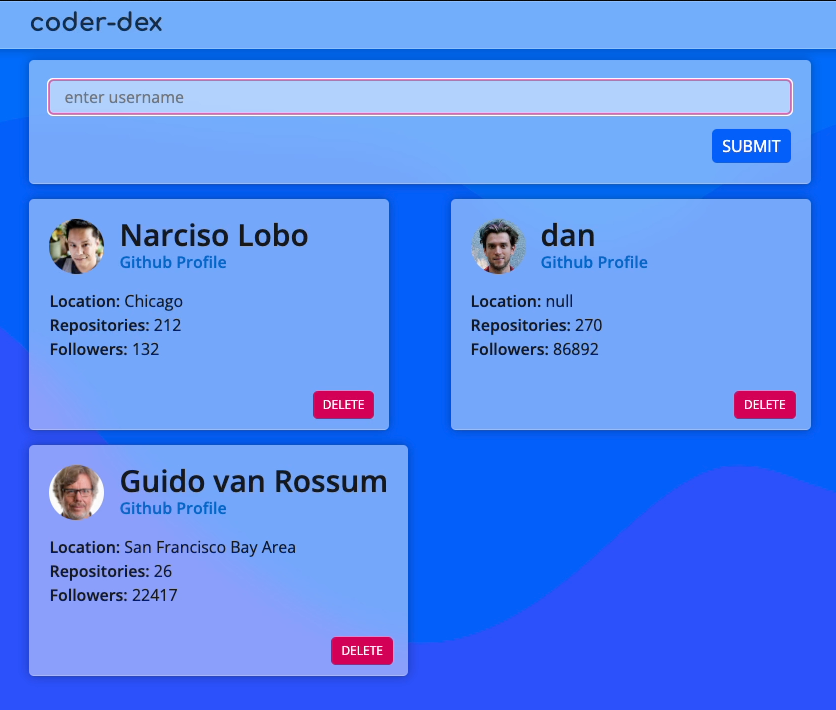

# APIs - A High-Level Overview

When discussing or researching topics about web development, you may have come across the acronym, API. It stands for Application Programming Interface, and we'll be discussing this topic today.

Afterwards, we will create an application that will allow users to retrieve information from the GitHub API.

## What is an API?

But what are APIs exactly, and why were they created? To answer this question, let's explore an analogy.

**The Restaurant Analogy**

When you go to a restaurant and order some food, you interact with the waiter. You can order food and drinks, ask questions about the menu, request and pay the bill, and much more.

In this example, the waiter is shielding you from all the complicated stuff that happens behind the scenes. You don’t have to worry about stoves, ovens, dishes, managing stock, or pouring drinks.

The waiter is the interface between you and all of the services that a restaurant offers, giving you a way to interact with the restaurant while still shielding you from all the complexity behind the scenes.

In a way, the waiter can be seen as the API of the restaurant. Through this example, we can understand why they are useful.

**Definition**
The term API stands for Application Programming Interface, and it’s a way for different programs to work together in various ways.

There are many types of APIs and and many reasons why APIs are used.

Here are a few major uses of an API:

1. Access Data
2. Abstract Complexity
3. Extend Functionality

### Access Data

APIs can be used to get access to data from third parties. In the restaurant example, the waiter can provide you with information on the status of your order, without you having to go to the kitchen yourself.

#### Examples:

1. **Weather Applications**:
    - The weather app on your phone doesn’t collect its own weather data. Instead, it uses the API of a third-party service, such as AccuWeather, to retrieve current weather conditions and forecasts. This allows the app to provide up-to-date weather information without having to maintain its own global network of weather stations.

2. **Social Media Feeds**:
    - Many websites and applications display social media feeds or allow users to share content directly from their platform. For instance, a news website might show the latest tweets related to a particular topic by using Twitter's API to fetch and display relevant tweets in real-time.

3. **E-commerce and Product Information**:
    - E-commerce platforms often use APIs to get information about products from various suppliers. For example, an online store might use an API to retrieve product details, stock levels, and pricing from different vendors, ensuring that their listings are accurate and up-to-date.

By using these APIs, applications can access a wealth of data that would otherwise be difficult or impossible to obtain directly, allowing them to provide richer and more relevant information to their users.

### Abstract Complexity

Aside from just accessing data, APIs can also be used to hide complexity and perform tasks. In the restaurant example, you don’t need to know how to prepare a perfect roll of sushi, you just order one.

#### Examples:

1. **Operating Systems**:
    - The operating systems on our computers and phones provide APIs that simplify complex tasks for developers. For example, an app developer can use the API provided by the operating system to establish a WiFi connection without needing to understand the underlying networking protocols.

2. **Graphical User Interfaces (GUIs)**:
    - When developing software with a graphical user interface, developers use APIs to handle the rendering of UI elements. For instance, instead of writing code to draw every pixel of a button, a developer can use the API to place a button on the screen, ensuring it looks consistent across different devices and screen resolutions.

3. **Hardware Interactions**:
    - Mobile devices have various sensors like accelerometers, gyroscopes, and GPS. Developers use APIs provided by the device’s operating system to interact with these sensors. For example, a fitness app can use the API to access the accelerometer data to track a user’s steps without needing to understand how the sensor works at a low level.

By abstracting complexity, APIs allow developers to perform sophisticated tasks with simple commands, enabling them to focus on the unique aspects of their applications rather than the intricacies of the underlying systems.

### Extend Functionality

APIs can also be used to extend functionality. This means that a software system can be enhanced or adapted to support new features without modifying its core codebase.

#### Examples:

1. **Widgets and Extensions**: 
    - On iOS, applications can show a widget in the Notification Center. To do that, the app notifies the system through an API that it has a widget available. If the user adds it to their Notification Center, the system will contact the app to ask how it should display the widget.
    - Similarly, web browsers like Chrome or Firefox support extensions that enhance browser functionality. Developers create these extensions using the browser's API to add features like ad-blocking, password management, or productivity tools.

2. **Voice Assistants**: 
    - Siri, Alexa, and Google Assistant are quite clever, but external developers can use these assistants' APIs to extend their functionalities even further. For example, developers can create custom skills or actions that allow these assistants to control smart home devices, provide specific information, or even place orders online.

3. **Payment Systems**:
    - Payment platforms like Stripe and PayPal offer APIs that allow developers to integrate payment processing into their websites or apps. This means that any e-commerce platform can accept payments without having to build a payment processing system from scratch.

By using these APIs, developers can leverage existing systems and services to create richer, more integrated applications without reinventing the wheel.

## Conclusion

APIs are a fundamental component of modern software development. They play a crucial role in enabling different systems to interact with each other efficiently and effectively. By understanding and utilizing APIs, developers can unlock possibilities that enhance the functionality, accessibility, and complexity management of their applications.

### Key Takeaways:

1. **Access Data**: 
    - APIs provide a standardized way to access data from third-party services. This capability is essential for integrating features like weather updates, social media feeds, financial data, and much more into your applications. By leveraging APIs, developers can enrich their apps with real-time data from diverse sources without having to build and maintain their own data collection systems.

2. **Abstract Complexity**: 
    - APIs simplify complex operations by abstracting the underlying processes. This abstraction allows developers to perform tasks such as connecting to the internet, rendering graphical interfaces, managing cloud resources, and interacting with hardware sensors with ease. By hiding the complexity, APIs enable developers to focus on creating innovative features and improving user experiences.

3. **Extend Functionality**: 
    - APIs allow developers to extend the capabilities of existing systems. Whether it's adding widgets to mobile operating systems, integrating with voice assistants like Siri or Alexa, enabling secure payment processing, or incorporating social media functionalities, APIs provide the tools to enhance and customize applications beyond their original scope.

### The Ubiquity of APIs:

APIs are omnipresent in the digital world. They form the backbone of countless applications and services we use daily, from mobile apps to web platforms and enterprise solutions. Understanding how to use APIs effectively is a critical skill for any developer, enabling them to build more powerful, scalable, and interoperable applications.

### Final Thoughts:

As technology continues to evolve, the importance of APIs will only grow. They are key to fostering innovation, enabling seamless integration, and driving efficiency in software development. These days, it's hard to find a service that does *not* use an API.

In summary, APIs are not just a tool for accessing data or simplifying tasks; they are a gateway to extending the functionality and interconnectivity of modern software. Embrace APIs, and you will unlock new levels of creativity and productivity in your journeys as developers.
