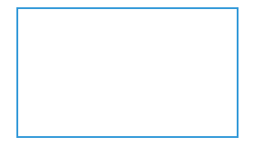

# Understanding the CSS Box Model
The box model is the foundation for layout and design in CSS, providing a structured way to understand how elements are sized, spaced, and interact with one another.

## Components of the Box Model
The CSS Box Model consists of four main components:
1. Content
2. Padding
3. Border
4. Margin

Each of these components contributes to the overall sizing and spacing of an element.

### Content
The content area is where the actual content of the element, such as text or images, is displayed.

It is defined by the width and height properties.

### Padding
Padding is the space between the content and the element's border.

It can be set using properties like `padding`, `padding-top`, `padding-right`, `padding-bottom`, and `padding-left`.

Padding helps control the internal spacing within an element.

### Border
The border surrounds the padding and content, giving a visual boundary to the element.

It can be customized with properties like `border`, `border-width`, `border-style`, and `border-color`.

Borders can be solid, dashed, or dotted, and they contribute to the overall size of the element.

### Margin
The margin is the space outside the element, creating separation between neighboring elements.

It can be set using properties like `margin`, `margin-top`, `margin-right`, `margin-bottom`, and `margin-left`.

Margins do not have a background color, and they provide external spacing.

## Box Model Demo

```html
<div class="box"></div>
```

```css
.box {
  width: 200px;
  height: 100px;
  padding: 20px;
  border: 2px solid #3498db;
  margin: 10px;
}
```



## Box Sizing Property
The `box-sizing` property allows control over how the total width and height of an element are calculated.

`box-sizing: content-box` includes only the content, while `box-sizing: border-box` includes padding and border in the total size.