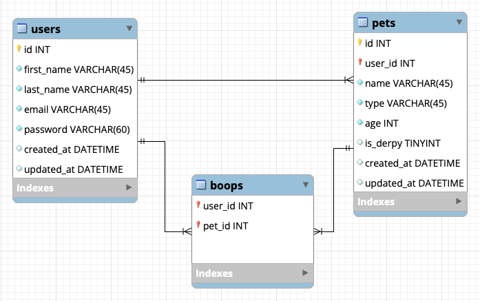

# CRUD Queries

*Note: MySQL Workbench students - [forward engineer](https://login.codingdojo.com/m/506/12462/87402) before trying these queries. ERD Editor students - execute the generated SQL [as per the slideshow](https://docs.google.com/presentation/d/1tY9dmx2ighhSHE5UXNkcMCW89beGezDZv2GGdiWwb74/edit#slide=id.g287d51aab8d_0_383).*

CRUD is an acronym for Create, Read, Update and Destroy. In this section of the stack, we'll be writing SQL statements to perform CRUD operations.

## CRUD to SQL

- Create = `INSERT`
- Read = `SELECT`
- Update = `UPDATE`
- Destroy = `DELETE`

The following examples will assume a schema like the one pictured below:



### Create
To create a row in our database tables, we will use the `INSERT` statement. Here's the syntax:

```sql
INSERT INTO <tablename> (<column1>, <column2>, etc.)
VALUES (<value1>, <value2>, etc.);
```

Given the above syntax, let's write a SQL statement to create a new user in our users table (soon, we will be encrypting passwords into 60-character strings. For now, it's okay to store plaintext passwords).

```sql
INSERT INTO users (first_name, last_name, email, password)
VALUES ("Bob", "Marley", "bob@thewailers.com", "stiritup");
```

Notice we do not have to provide values for `id`, `created_at`, or `updated_at`. The `id` is automatically incremented by MySQL for us, and we have provided defaults for `created_at` and `updated_at`.

### Read
To read a row or rows from our database tables, we will use the `SELECT` statement. Here's the syntax for retrieving all rows:

```sql
SELECT <column1>, <column2>, etc. FROM <tablename>;
```

Alternatively, we can use the wildcard character (*) to retrieve data from all columns:

```sql
SELECT * FROM <tablename>;
```

Given the above syntax, let's write a SQL statement to retrieve all data from all columns in the users table.

```sql
SELECT * FROM users;
```

The above statement may produce a results grid like this:

| id  | first_name | last_name | email              | password       | created_at          | updated_at          |
| --- | ---------- | --------- | ------------------ | -------------- | ------------------- | ------------------- |
| 1   | Etta       | James     | etta@atlast.com    | misspeaches    | 2023-08-08 09:43:20 | 2023-08-08 09:43:20 |
| 2   | Bill       | Withers   | bill@stillbill.com | aintnosunshine | 2023-08-08 09:55:43 | 2023-08-08 09:55:43 |
| 3   | Gladys     | Knight    | gladys@thepips.com | midnighttrain  | 2023-08-08 10:05:27 | 2023-08-08 10:05:27 |
| 4   | Bob        | Marley    | bob@thewailers.com | stiritup       | 2023-08-08 11:08:53 | 2023-08-08 11:08:53 |

Our projects will also require that we retrieve only one row from the database. For these operations, we want to use a `SELECT FROM WHERE` statement. Here's the syntax:

```sql
SELECT * FROM <tablename>
WHERE <column> = <value>;
```

Using our example schema, in order to retrieve the user with an `id` of 4 we could do the following:

```sql
SELECT * FROM users
WHERE id = 4;
```

This statement would return the data from all the columns in the users table for the user with an `id` of 4. The results may look like so:

| id  | first_name | last_name | email              | password | created_at          | updated_at          |
| --- | ---------- | --------- | ------------------ | -------- | ------------------- | ------------------- |
| 4   | Bob        | Marley    | bob@thewailers.com | stiritup | 2023-08-08 11:08:53 | 2023-08-08 11:08:53 |

### Update

An update CRUD operation requires an `UPDATE` SQL statement. Here's the syntax:

```sql
UPDATE <tablename>
SET <column1> = <value1>, <column2> = <value2>, etc.
WHERE <column> = <value>;
```

If we wanted to change Gladys Knight's email address, we could do that like so:

```sql
UPDATE users
SET email = "gladys@gladysknight.com"
WHERE id = 3;
```

### Delete
A delete operation requires a `DELETE` statement. Here's the syntax:

```sql
DELETE FROM <tablename>
WHERE <column> = <value>;
```

To delete Bob Marley, we would execute the following statement:

```sql
DELETE FROM users
WHERE id = 4;
```
